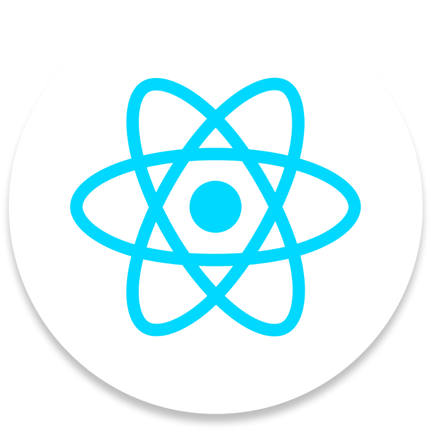
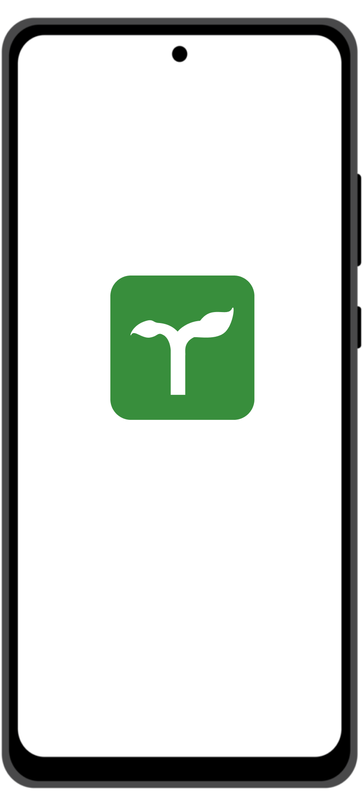

<br>
<div align="center">
    <div >
        
    </div>
    <div>
            <h3><b>TerraFarm</b></h3>
            <p><i>Cultivating Smarter, Growing Stronger.</i></p>
    </div>      
</div>
<br>
<h1 align="center">TerraFarm Frontend Website</h1>
<div align="center">


</div>
<br>
<i>Your personalized farming assistant</i>: TerraFarm’s web application brings Earth observation data right to the farmer's fingertips with an intuitive, mobile-first design. Its engaging interface provides real-time insights, dynamic recommendations, and easy access to community-powered solutions. Whether you're online or offline, TerraFarm empowers farmers to make informed decisions, enhancing yields and minimizing risks with just a few taps.

## 👨🏻‍💻 &nbsp;Technology Stack

<div align="center">
<a href="https://react.dev/">
<kbd>

</kbd>
</a>

<a href="https://www.typescriptlang.org/">
<kbd>

</kbd>
</a>

<a href="https://tailwindcss.com/">
<kbd>

</kbd>
</a>

<a href="https://ui.shadcn.com/">
<kbd>

</kbd>
</a>
</div>
<div align="center">
<h4>React | Typescript  | TailwindCSS | ShadcnUI</h4>
</div>
<br>

## ⚙️ &nbsp;How to Run
1. Clone this repository from terminal using this following command
   ```bash
   $ git clone https://github.com/TerraFarm-TaniMakmur88/TerraFarm_Frontend.git
   ```
2. Install all the required dependencies using this following command in the project root directory
   ```bash
   $ npm install
   ```
3. Run the website using this following command
   ```bash
   $ npm run dev
   ```

## 📸 &nbsp;Website Preview
<table style="width:100%; text-align:center;">
    <col width="32%">
    <col width="32%">
    <col width="32%">
    <tr>
        <td width="1%" align="center"></td>
        <td width="1%" align="center"></td>
        <td width="1%" align="center"></td>
    </tr>
    <tr>
        <td width="1%" align="center"></td>
        <td width="1%" align="center"></td>
        <td width="1%" align="center"></td>
    </tr>
    <tr>
        <td width="1%" align="center"></td>
        <td width="1%" align="center"></td>
        <td width="1%" align="center"></td>
    </tr>
    <tr>
        <td width="1%" align="center"></td>
        <td width="1%" align="center"></td>
        <td width="1%" align="center"></td>
    </tr>
</table>

## 👥 &nbsp;Contributors
| <div align="center"><a href="https://github.com/mikeleo03"></a></div> | <div align="center"><a href="https://github.com/arleenchr"></a></div> | <div align="center"><a href="https://github.com/AustinPardosi"></a></div> |
| ---------------------------------------------------------------------------------------------------------------------------------------------------------------------------------------------------------------------------------- | ----------------------------------------------------------------------------------------------------------------------------------------------------------------------------------------------------------------------------------- | ----------------------------------------------------------------------------------------------------------------------------------------------------------------------------------------------------------------------------- |
| <div align="center"><h3><b><a href="https://github.com/mikeleo03">Michael Leon Putra Widhi</a></b></h3><i><p>Bandung Institute of Technology</i></p></div>                                                                                        | <div align="center"><h3><b><a href="https://github.com/arleenchr">Arleen Chrysantha Gunardi</a></b></h3></a><p><i>Bandung Institute of Technology</i></p></div>                                                               | <div align="center"><h3><b><a href="https://github.com/AustinPardosi">Austin Gabriel Pardosi</a></b></h3></a><p><i>Bandung Institute of Technology</i></p></div>                                                                            
| <div align="center"><a href="https://github.com/Nat10k"></a></div> | <div align="center"><a href="https://github.com/manuellaiv"></a></div> | <div align="center"><a href="https://github.com/Mehmed13"></a></div> |
| <div align="center"><h3><b><a href="https://github.com/Nat10k">Nathan Tenka</a></b></h3><i><p>Bandung Institute of Technology</i></p></div>                                                                                        | <div align="center"><h3><b><a href="https://github.com/manuellaiv">Manuella Ivana Uli Sianipar</a></b></h3></a><p><i>Bandung Institute of Technology</i></p></div>                                                               | <div align="center"><h3><b><a href="https://github.com/Mehmed13">Muhammad Fadhil Amri</a></b></h3></a><p><i>Bandung Institute of Technology</i></p></div>                                                                            |